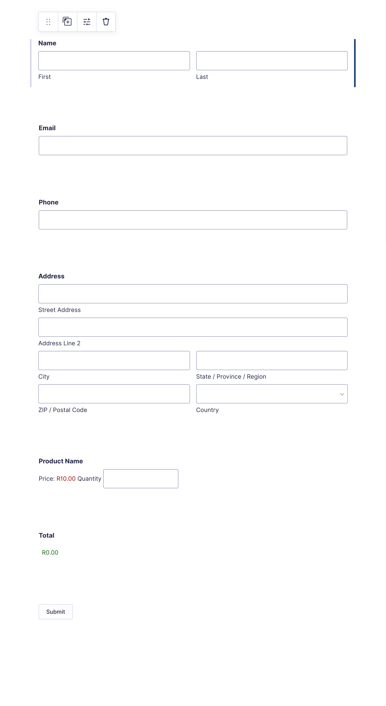
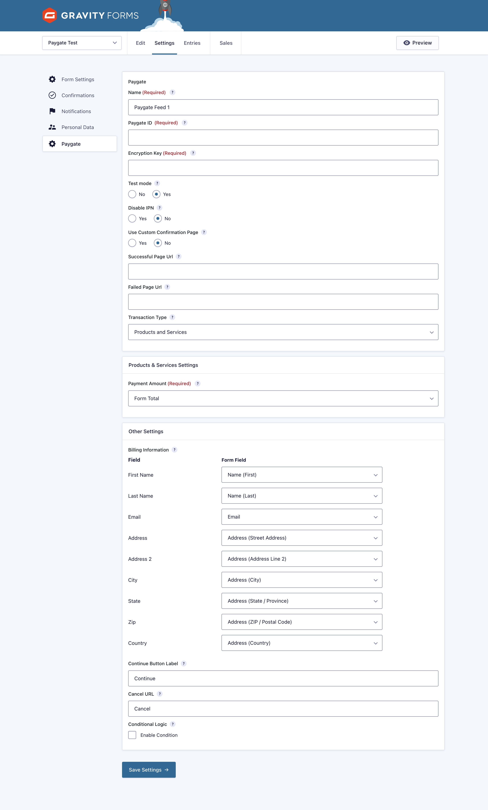
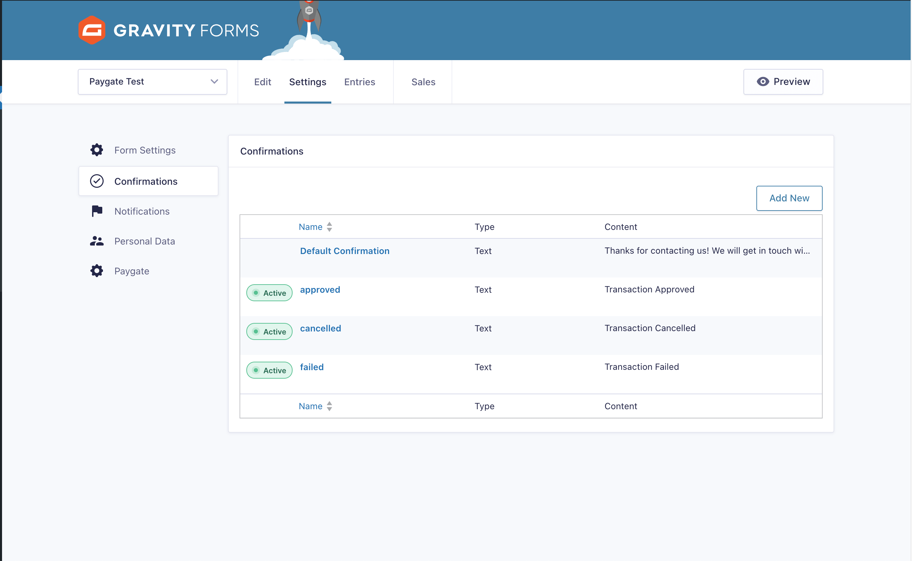

# PayWeb_Gravity_Forms

## Paygate Gravity Forms Plugin v2.6.1 for Gravity Forms v2.9.1

This is the Paygate plugin for Gravity Forms. Please feel free to contact the Payfast support team at
support@payfast.help should you require any assistance.

## Installation

1. **Download the Latest Release**
    - Visit the [releases page](https://github.com/Paygate/PayWeb_Gravity_Forms/releases) and
      download [gravity-forms-paygate-plugin.zip](https://github.com/Paygate/PayWeb_Gravity_Forms/releases/download/v2.6.1/gravity-forms-paygate-plugin.zip).

2. **Install the Plugina**
    - Log in to your WordPress Admin panel.
    - Navigate to **Plugins > Add New > Upload Plugin**.
    - Click **Choose File** and locate the `gravity-forms-paygate-plugin.zip` file.
    - Click **Install Now**.
    - Click **Activate Plugin**.

3. **Configure the Plugin**
    - Click on the **Forms** link in your WordPress Admin.
    - Select the form you want to integrate with Paygate.
    - Under **Form Settings**, click **Paygate**.
    - Under the **Paygate Feeds** section, click **Add New** and provide the required data:
        - **Transaction Type**: Select "Products and Services."
        - **Map Paygate Fields**: Ensure the following fields are properly mapped:
            - Pricing Fields
            - Address Fields
            - Email Field
            - Map Paygate **Country Field** with the form **Country Field**.
            - Map Paygate **Email Field** with the form **Email Field**.
    - Click **Update Settings/Save Settings** to save the configuration.

> 
> 

4. **Configure Confirmation Messages**
    - Go to the **Confirmations** section.
    - Add three new confirmations with the following names:
        - **Confirmation Name: failed**
        - **Confirmation Name: cancelled**
        - **Confirmation Name: approved**

> 

## Collaboration

Please submit pull requests with any tweaks, features or fixes you would like to share.
